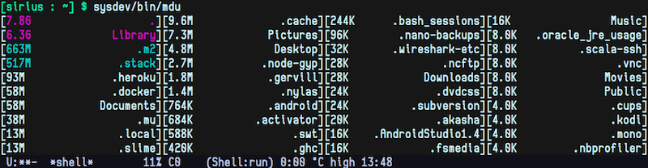

# mdu

A simple clojure wrapper for *nix du applying my layout preferences during
cleanup activities.

One image says it all.

color scheme: magenta: > 1G; cyan:    > 128M

## Install

Use `leiningen uberjar` or if you prefer a self contained executable add
`[lein-bin "0.3.5"]` to the `plugins:` section of `~/.lein/profiles.clj`, run
'lein bin' to produce the executable.

## Usage
mdu [dir]

## License

Copyright © 2016 Pedro Major <pedro.major@gmail.com>

Distributed under the Eclipse Public License either version 1.0 or (at
your option) any later version.
